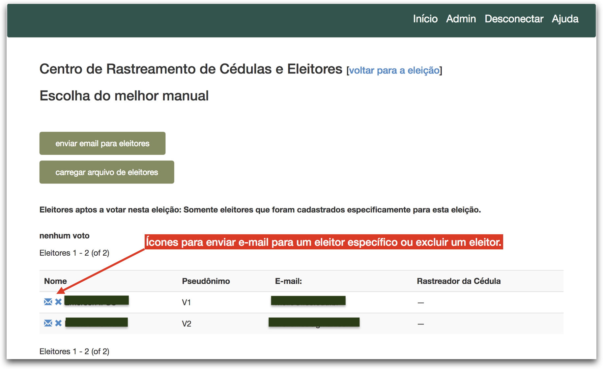

# Como iniciar uma eleição

## Congelando cédula e abrindo eleição

1. Acesse o endereço [http://helios.ifsc.edu.br](http://helios.ifsc.edu.br), clique no menu **Conectar** e forneça seu nome de usuário e senha.
2. Na lista que aparece no lado direito da tela, clique no link da eleição que deseja iniciar
3. Na página inicial da eleição, clique no *link* **congelar cédula e abrir eleição**.
    - **[Se ao criar a eleição](criar.md)** você especificou uma data e horário para o campo **Votação começa em**, então a **eleição será aberta automaticamente somente após** a data e horário especificado.
    - **[Se ao criar a eleição](criar.md)** você não especificou uma data e horário para o campo **Votação começa em**, então a **eleição será aberta imediatamente**.
      

4. Se estiver certo que deseja abrir a eleição, clique no botão **Congelar a cédula**.
    - **Atenção:** Após congelar a cédula não será possível alterar qualquer informação sobre a eleição, o que inclui suas questões, respostas, apuradores, etc.
      

## Disparando e-mail com as credenciais para os eleitores

Cada eleitor precisa receber por e-mail suas credenciais (*login* e senha) exclusivas para votar na referida eleição. É possível enviar e-mails em massa, ou seja, para todos os eleitores cadastrados, ou ainda, é possível enviar e-mail para um eleitor específico.

1. Na página inicial da eleição clique no botão **Eleitores & cédulas**.
    - **Se deseja enviar e-mail em massa** (para todos eleitores cadastrados), clique no botão **Enviar e-mail para eleitores**.

    - **Se deseja enviar e-mail para um eleitor em específico**, então clique no ícone do envelope azul que esteja na linha com o nome do eleitor para quem deseja enviar e-mail.

    - **Se deseja adicionar novos eleitores**, então clique no botão **Carregar arquivo de eleitores**.

    - **Se deseja remover um eleitor em específico**, então clique no ícone de um X azul que esteja na linha com o nome do eleitor que deseja excluir.

        

2. Escolha o tipo de e-mail **Hora de votar**

3. No campo **Assunto** informe o assunto do e-mail, por exemplo, "Eleição para escolha do conselho 2018 está aberta para votação"

    - Opcionalmente, no campo **Corpo**,  é possível incluir uma mensagem que aparecer no corpo do e-mail.

4. Na caixa de seleção **Enviar Para** é possível escolher se deseja enviar para:

    - **Todos os eleitores registrados**; ou
    - **Somente para os eleitores que já depositaram uma cédula**; ou
    - **Somente para os eleitores que não depositaram qualquer cédula**; ou ainda
    - **Envio contingenciado** - somente para os eleitores que ainda não receberam e-mail (**X/Y**)
        - **ATENÇÃO:** Só use essa opção após consultar a equipe técnica de TI 
        - Essa opção permite o envio de pequenos lotes de e-mail, cujo tamanho foi definido em tempo de implantação (por padrão 1.000). Toda vez que essa opção for escolhida, serão enviados e-mails para os próximos 1.000 eleitores da lista.
        - O **valor X** indica o total de eleitores que já recebeu e-mail desse modelo (tipo de e-mail).
        - O **valor Y** indica o total de eleitores registrados para a eleição.
        - **Atenção:** O administrador da eleição é o único responsável por garantir que todos os eleitores de uma eleição receberam o e-mail. Ou seja, o valor de **X** deverá ser igual ao valor de **Y**.

5. Clique no botão **Enviar**. 

6. Pronto! Você será redirecionado para a página inicial da eleição.

