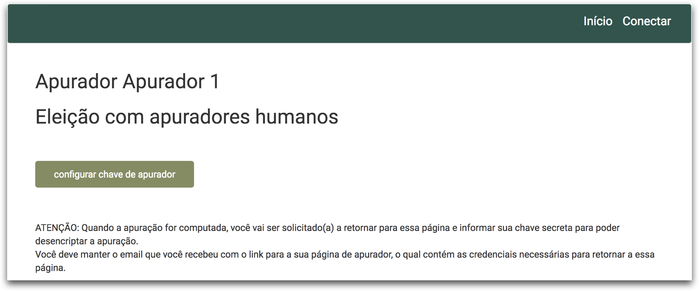
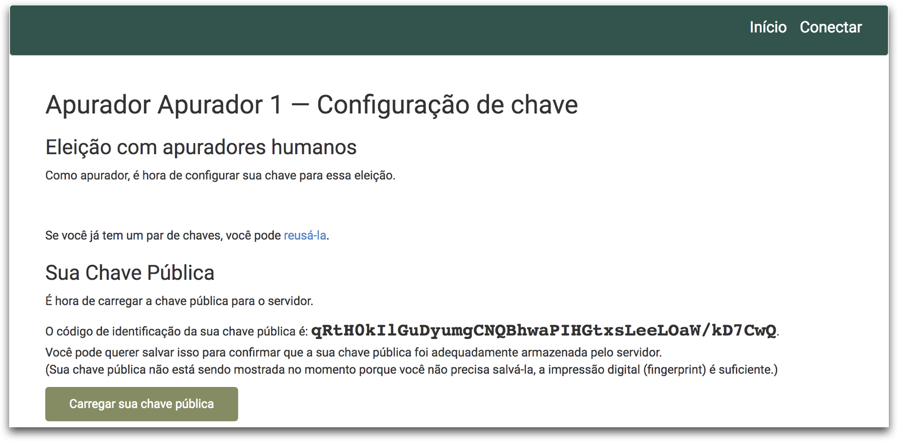
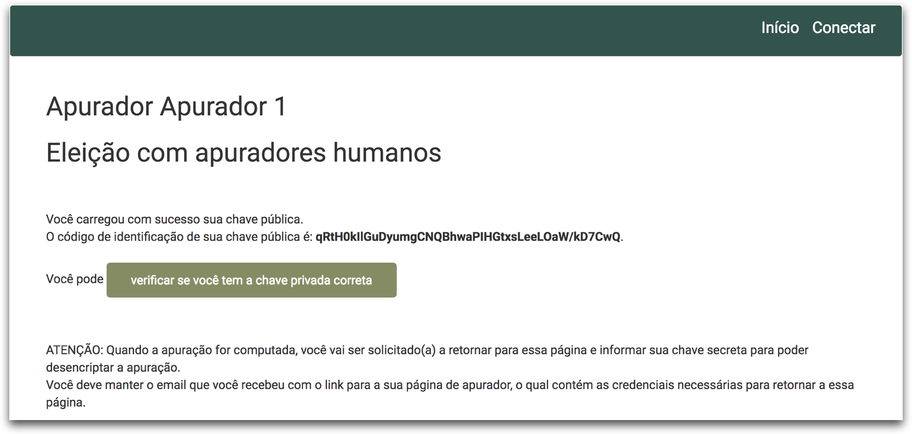

Ao ser designada como um Apurador, a pessoa receberá um e mail do Sistema de Votação Helios com as instrução e um *link* para que essa possa gerar ou carregar sua chave privada. A pessoa deve obrigatoriamente entrar no *link* que está no e-mail para que possa carregar suas informações de apurador. 

**ATENÇÃO:** O apurador deve manter esse e-mail, pois a URL contida nele deverá ser usada novamente para que se possa apurar a eleição.

1.  Após clicar no *link* que recebeu por e-mail, clique no botão configurar **chave de apurador**.

    

2.  Clique no botão **Gerar Chaves da Eleição**.

    

3.  Clique no botão **Salve sua chave privada**. Será aberta uma nova aba no navegador com uma sequência numérica grande. Clique no meu arquivo do navegador e escolha a opção **Salvar**. 

    -   Escolha o local onde o arquivo será salvo e coloque o nome que desejar para o arquivo, mas deixe a extensão como txt. Por exemplo, **minha-chave-privada.txt**. Clique no botão salvar e pode fechar essa janela ou aba.
    -   Salve esse arquivo em um local seguro, pois ele será necessário no momento da apuração. 

    

4.  Clique no *link* **ok, a chave foi salva, vamos prosseguir**.

    

5.  Por fim, clique no botão **Carregar sua chave pública**.

    

6.  Parabéns, você carregou a chave com sucesso! Se desejar, você pode fazer um teste a fim de verificar se possui a chave privada correta, basta clicar no botão **verificar se você tem a chave privada correta**. Esse passo é opcional.

    

    ​