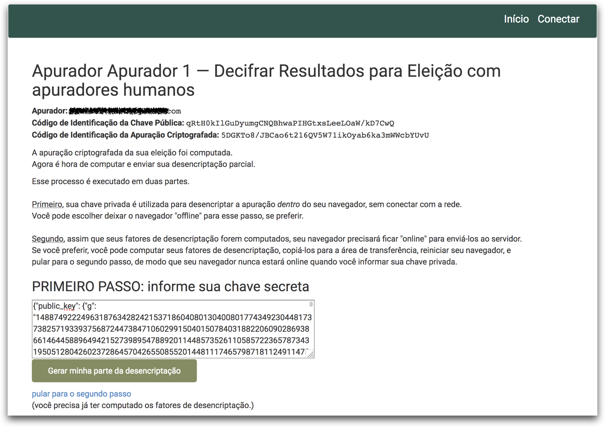
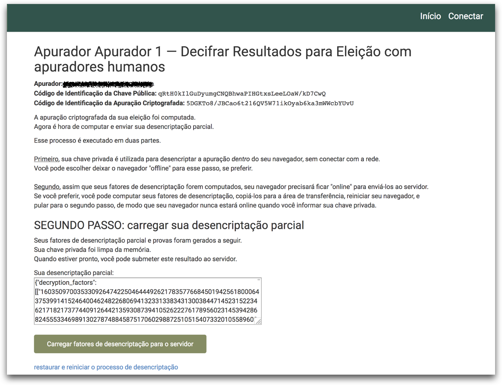
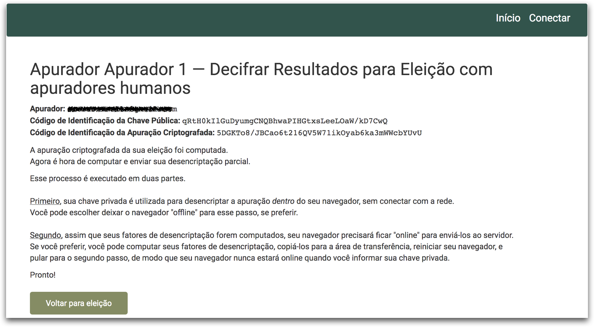

1.  Abra o e-mail que recebeu quando foi designado como apurador e clique no endereço *link* contido neste.

2.  Clique no **botão decifrar com sua chave**.

    

3.  Abra o arquivo onde você salvou sua chave criptográfica (usando por exemplo o aplicativo bloco de notas), copie toda a sequência de caracteres e cole na área de texto em branco da figura abaixo

    

4.  Clique no botão **Gerar minha parte da desencriptação**.

    

5.  Clique no botão **Carregar fatores de desencriptação para o servidor**.

    

6.  Pronto, você concluiu a sua parte da apuração desta eleição. Cabe agora ao administrador da eleição realizar o procedimento para computar e publicar o resultado da eleição.

    

    ​