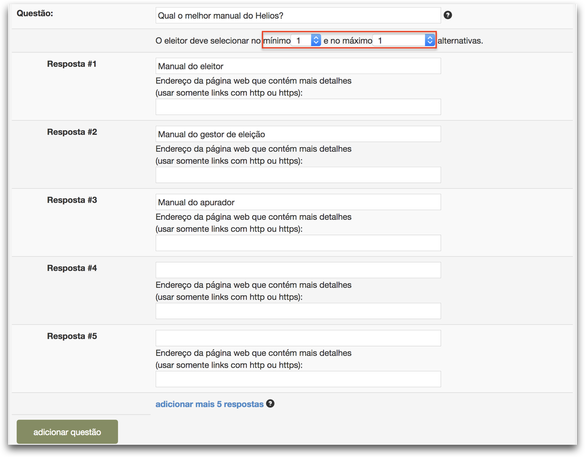
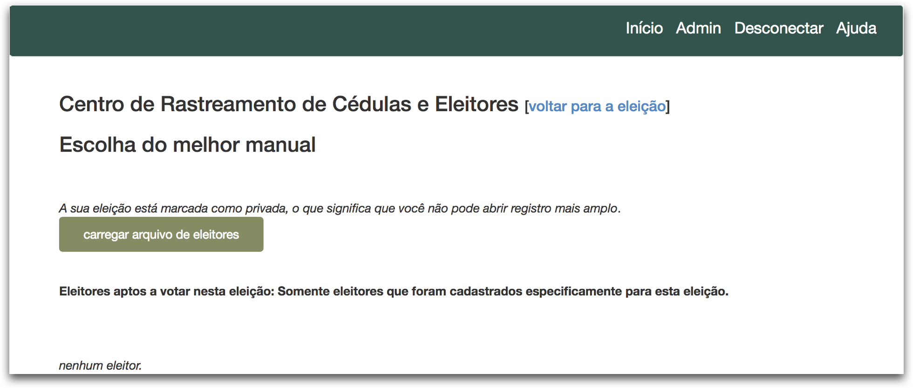
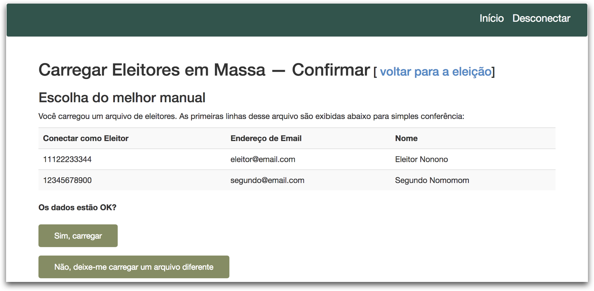
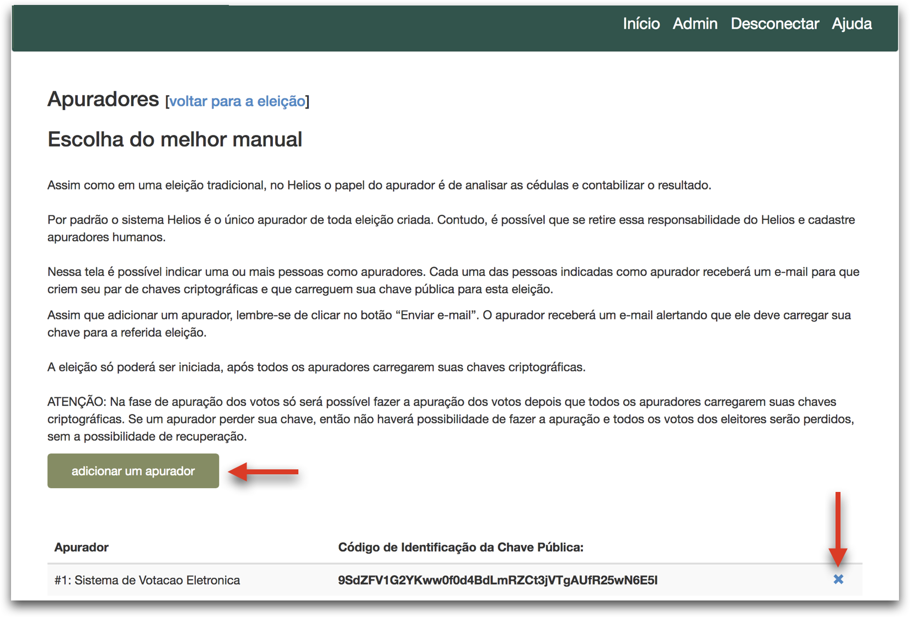

# Como criar uma eleição


## Informações gerais

1. Acesse o endereço [http://helios.ifsc.edu.br](http://helios.ifsc.edu.br), clique no menu **Conectar** e forneça seu nome de usuário e senha.

2. Clique no botão **Criar eleição** e preencha o formulário conforme orientação abaixo:

| **Campo**                                     | **Descrição**                                                |
| --------------------------------------------- | ------------------------------------------------------------ |
| **Nome abreviado**                            | Nome que aparecerá na URL da eleição. Escolha um nome que faça sentido para eleição, contudo esse nome **NÃO PODE conter espaços**. |
| **Nome**                                      | Nome que aparecerá em destaque para os eleitores. Escolha um nome que os eleitores possam facilmente identificar que eleição estão prestes a votar. Por exemplo: *Eleição do Conselho XYZ 2018* |
| **Descrição**                                 | Pode colocar informações detalhadas sobre a eleição, por exemplo, alguns pontos cruciais do edital, regimento da eleição, etc. |
| **Usar pseudônimos de eleitores**             | Se marcada, a identidade dos eleitores será substituída por pseudônimos, p. ex.: "V12", no centro de rastreamento de cédulas. **É altamente recomendado deixar ativado essa opção.** |
| **Usar funcionalidade avançada de auditoria** | Ao ativar essa opção, os eleitores terão acesso a funcionalidades que permitiriam auditar a eleição, contudo deixaria a interface um pouco mais complicada. **Recomenda-se deixar desativada essa opção**. |
| **Tornar ordem das questões aleatória**       | Habilite essa opção se você quiser que as questões apareçam em ordem aleatória para cada eleitor |
| **Endereço de email para ajuda**              | Informe um endereço de email que os eleitores devem usar caso precisem de alguma ajuda. |
| **Votação começa em**                         | A partir dessa data e horário os eleitores poderão depositar cédulas na urna. Contudo, ainda é necessário que o gestor abra a eleição (**[veja o manual](abrir.md)**). |
| **Votação termina em**                        | A partir dessa data e horário não será mais possível depositar cédulas na urna. |


3. Por fim, clique no botão **Próximo** e você verá a página incial da eleição, conforme figura abaixo:


____________


## Adicionando questões

Na página inicial da eleição clique no botão **Questões**.  É possível adicionar quantas questões forem necessárias.

- **Uma eleição** é composta por uma ou mais questões.
- **Uma questão** é composta por uma ou mais respostas.
  - É necessário que indique o **número mínimo e o número máximo de respostas** que o eleitor poderá escolher.
  - Por padrão aparecem campos para 5 respostas. Você pode preencher menos que 5, contudo se precisar mais que 5, então clique no *link* **adicionar mais 5 respostas**.
- Cada resposta pode ter (opcional), além do texto principal, o endereço de uma página web externa.
  - Nessa página poderia conter informações adcionais sobre a resposta. Por exemplo, essa página poderia conter uma mini biografia do candidato. 




Ao terminar de criar as questões clique no *link*  **[Voltar para a eleição]**, que se encontra no topo da página, para voltar para a página inicial da eleição.


-----------------


## Carregando lista de eleitores

Na página inicial da eleição clique no botão **Eleitores & Cédulas**. 

Só poderão votar em uma eleição os eleitores que forem carregados por meio de um arquivo CSV. Cada linha do arquivo do CSV representa um único eleitor e é composta pelos seguintes campos:

 `login, endereço-de-email,Nome Completo`. 

Exemplo:

```
11122233344,eleitor@email.com,Eleitor Nonono
12345678900,segundo@email.com,Segundo Nomomom
```



1. Clique no botão **carregar arquivo de eleitores**
2. Na próxima página clique no botão para procurar o arquivo CSV no disco do seu computador e por fim clique no botão **Carregar**.
3. Será apresentada uma prévia do arquivo que você está prestes a carregar. Se estiver correto, então clique no botão **Sim, carregar**. Se deseja carregar outro arquivo, então clique no botão **Não, deixe-me carregar um arquivo diferente**. 



**Atenção:** O tempo de processamento depende do tamanho do arquivo que fora carregado. Atualize a página (pressionando o botão "Atualizar" do teu navegador *web*) para verificar o progresso do processamento do arquivo. 


Por fim, clique no link **voltar para a eleição** que está no topo da página. E se optar por deixar o sistema Helios como o único apurador, então vá para o manual **[Como iniciar uma eleição](abrir.md)** e ignore as seções abaixo.


-------

##  Definindo o responsável pela apuração da eleição

Por padrão para toda nova eleição o sistema Helios fica como o único apurador. **Essa opção deve ser usada sempre que possível, pois torna mais fácil a gestão da eleição.** 

Se você optou pelo Helios como apurador, parabéns! Sua eleição foi criada com sucesso e pode ir ler o manual **[Como iniciar uma eleição e enviar e-mail para os eleitores](abrir.md)**.

Porém, se está criando uma eleição onde é necessário separar a responsabilidade de apuração para outra(s) pessoa(s), então é recomendado que se adicione apuradores humanos. Com os  apuradores humanos só será possível "abrir a urna para fazer a apuração" depois que esses apuradores entrarem no Helios e usarem sua chave  criptográfica (criada em um momento anterior). 

### Adicionar apuradores humanos

1. Na página inicial da eleição clique no botão **Apuradores**.
2. Clique no **ícone X azul** que aparece no lado direito para **remover o apurador #1 Sistema de Votação Eletrônica**.
3. Clique no botão **Adicionar um apurador**.




1. Forneça o Nome Completo e o endereço de e-mail da pessoa que será o apurador e clique no botão **Adicionar Apurador**
   - É possível adicionar quantos apuradores desejar, porém tenha em mente que essas pessoas serão as únicas que poderão abrir a urna para realizar a apuração. Basta que uma dessas pessoas não forneça sua chave para abrir a urna e isso será o suficiente para impedir que a urna seja aberta. Tenha cautela ao usar apuradores humanos
2. Para que o apurador receba as instruções por e-mail, clique no **ícone azul de um envelope** que aparece para cada apurador. 
3. Você poderá ver o “código de identificação da chave pública” dos apuradores assim que eles carregarem suas chaves (de acordo com o manual **[Como gerar e carregar sua chave criptográfica](apurador-gerar)**). Se esta informação estiver em branco, então significa que o apurador ainda não carregou sua chave pública.
    
4. Por fim, clique no link **Voltar para a eleição** e vá para o manual **[Como iniciar uma eleição](abrir.md)**.

