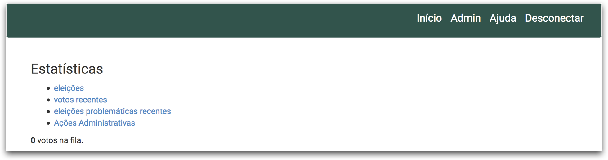
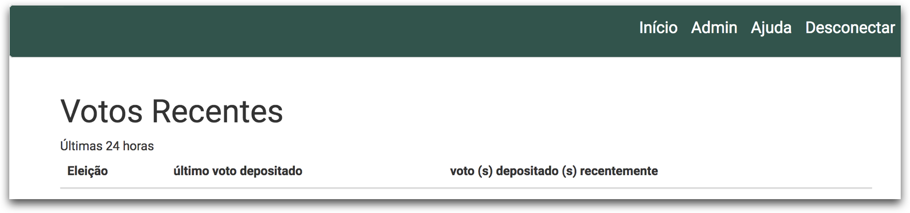

# Estatísticas de eleições

Na barra de menus superior o menu **Admin** leva para a página onde é possível ver algumas estatísticas das eleições criadas, estando essas em andamento ou já finalizadas. As funcionalidades possíveis são apresentadas na figura abaixo.

## Menu Eleições

No item **eleições** é apresentada uma listagem com todas as eleições criadas por todos os usuários. São apresentadas informações como:

-   Nome da eleição
-   O nome do usuário que criou a eleição
-   Total de eleitores de uma eleição e total de eleitores que depositaram um voto
-   Lista com os emails que foram entregues

Ao clicar no link **visualizar**, da coluna e-mails enviados, é possível ver o histórico de envio de e-mails para cada eleitor.

## Menu Votos Recentes

No item **votos recentes** é possível verificar os votos que foram depositados nas últimas 24 horas. 

## Menu Eleições problemáticas recentes

No item **eleições problemáticas recentes** é possível observar quais eleições tiveram algum tipo de problema recentemente.

## Menu Ações Administrativas

No item **Ações Administrativas** é possível ver um registro (*log*) de todos os eleitores que foram excluídos de alguma eleição. Essa página poderia ajudar, por exemplo em um processo de auditoria, a comprovar que nenhum eleitor foi excluído intencionalmente pelo administrador da eleição.

