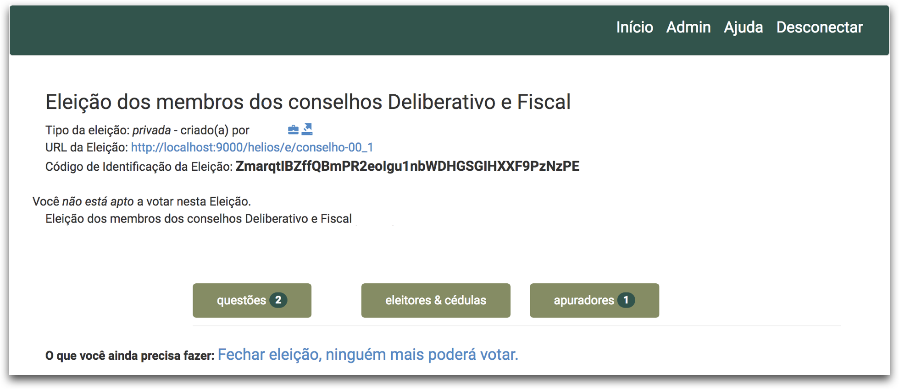
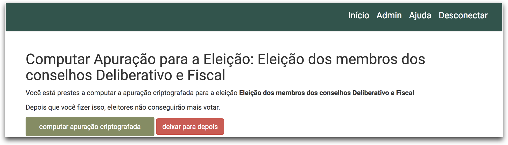
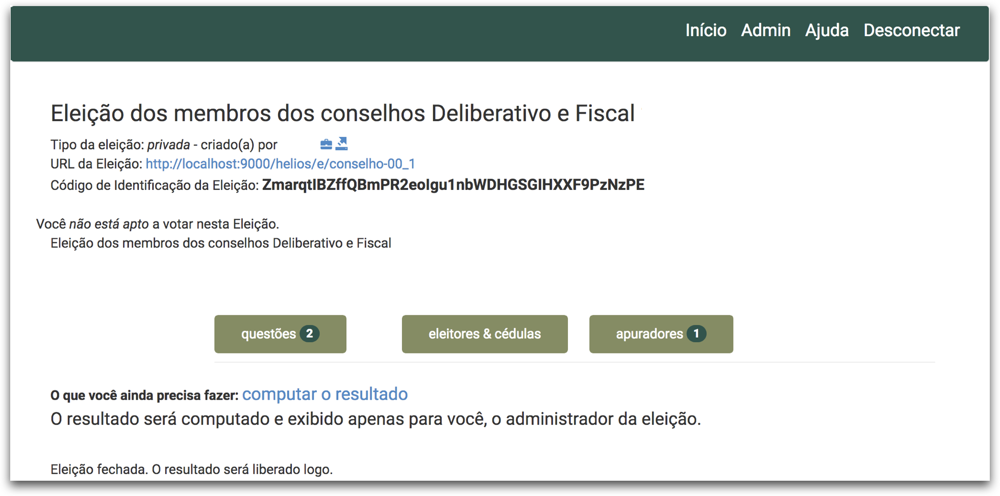
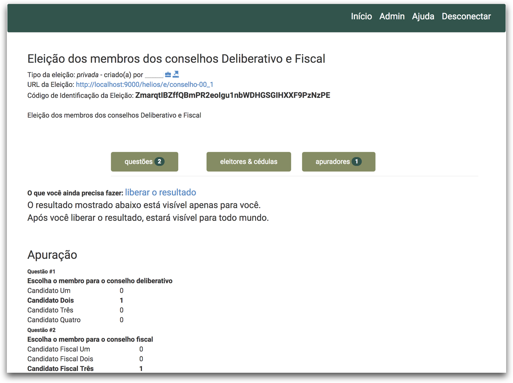
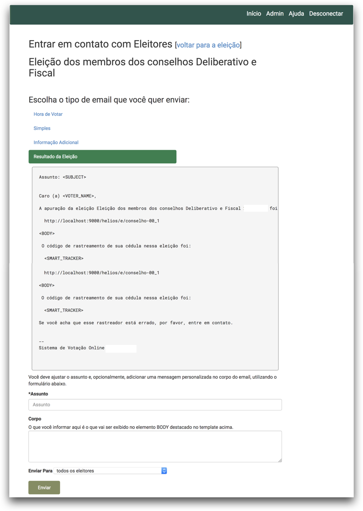
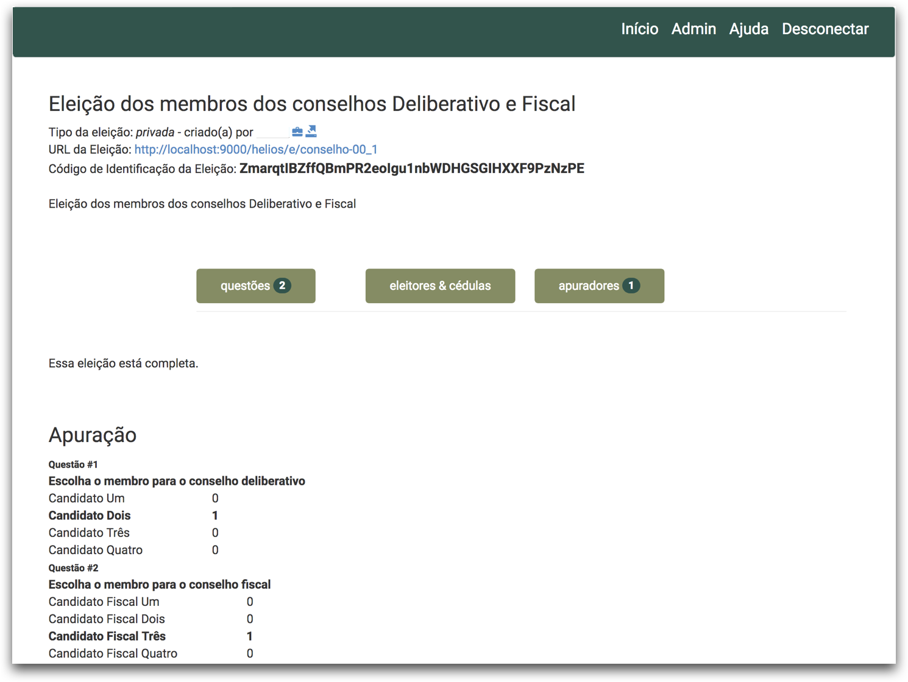

# Como finalizar uma eleição

**Atenção:** Após fechar uma eleição, nenhum eleitor poderá mais colocar votos na urna. Esse processo não pode ser desfeito. 

## Finalizando uma eleição

Abaixo são apresentados os passos para fechar, apurar e tornar público o resultado de uma eleição tendo o sistema Helios como o único apurador. Se sua eleição possui apuradores humanos, então veja o manual **[Fechando uma eleição com apuradores humanos](#fechando-uma-eleicao-com-apuradores-humanos)**.

1. Entre na página inicial da eleição e clique no *link* **Fechar eleição, ninguém mais poderá votar**.

    

2. Clique no botão **Computar apuração criptografada**.

    

3. Você será redirecionado para a página inicial da eleição (veja figura abaixo) informando que a apuração está a caminho. 

   - Para acompanhar o progresso desse processo é necessário ficar atualizando a página manualmente (clicar no ícone “Recarregar página” no seu navegador).

    

4. Quando a apuração terminar, na página inicial da eleição clique no *link* **Computar o resultado**. 

    

5. Clique no botão **computar a apuração** e você será redirecionado para a página inicial da eleição e no final dessa página estará o resultado, que no momento, somente você conseguirá ver.

    

6. Clique no *link* **liberar o resultado**, para que esse resultado fique público na página da eleição.

    

7. Ao liberar o resultado existe a opção de enviar por e-mail um aviso aos eleitores que a apuração foi encerrada e que os resultados estão públicos. Se desejar enviar e-mail, deixe marcada a caixa de seleção e clique no botão **liberar o resultado**.

    

    - Clique no botão **Resultado da eleição**. e obrigatoriamente você deverá informar um **assunto** do e-mail a ser enviado. Opcionalmente você pode escrever um texto que aparecerá no corpo do e-mail.
    - Selecione para qual público o e-mail deverá ser enviado
        - todos eleitores; ou
        - somente os que depositaram cédula; ou 
        - somente os que ainda não depositaram
    - E clique no botão **Enviar**

    

8. Pronto! A eleição foi finalizada, as cédulas foram computadas e o resultado foi publicado.

    

## Fechando uma eleição com apuradores humanos

1. Entre na página inicial da eleição e clique no *link* **Fechar eleição, ninguém mais poderá votar**.

    

2. Clique no botão **Computar apuração criptografada**.

    

3. Você será redirecionado para a página inicial da eleição (veja figura abaixo) informando que a apuração está a caminho. 

   - Para acompanhar o progresso desse processo é necessário ficar atualizando a página manualmente (clicar no ícone “Recarregar página” no seu navegador).

    

4. Avise seus apuradores, *i.e.* enviando um e-mail para eles, que estes precisam carregar suas chaves criptográficas para iniciar a apuração da eleição. 

    1. Os apuradores deverão seguir as instruções presentes no manual **[Como usar sua chave para apurar uma eleição](apurador-usar)**
    2. É possível verificar quais apuradores já carregaram suas chaves e quais ainda não carregaram. Para isso, vá na página inicial da eleição e clique no botão **Apuradores**.
        - Aqueles que não carregaram estarão com um ícone de um círculo preto com a **letra i** no seu interior.
        - Aqueles que carregaram sua chave estarão com um ícone de um círculo preto com a **letra v** no seu interior.

5. Uma vez que todos os apuradores inseriram suas chaves, basta seguir os **[passos de 4 a 9 presentes no início desse manual](#finalizando-uma-eleicao)**.